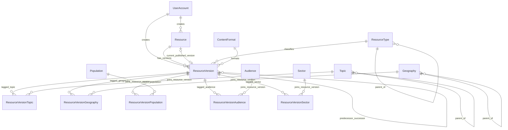
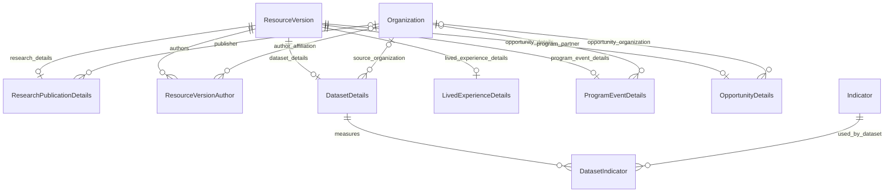
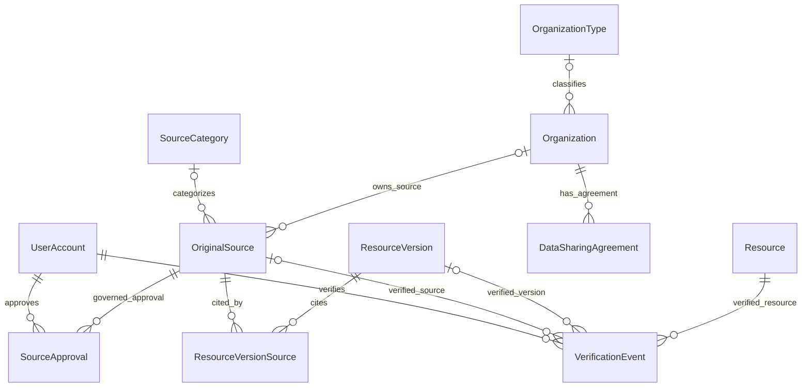
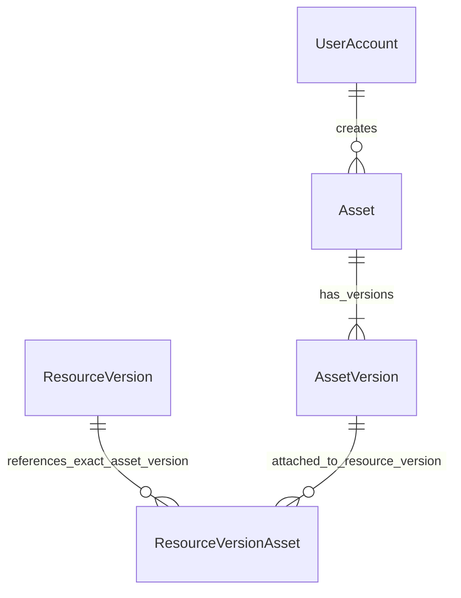
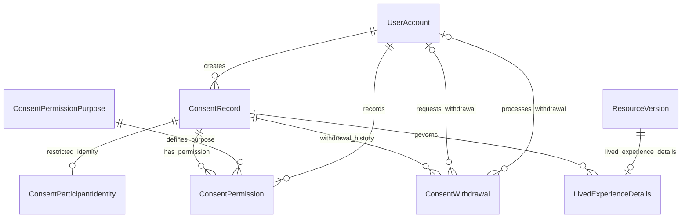
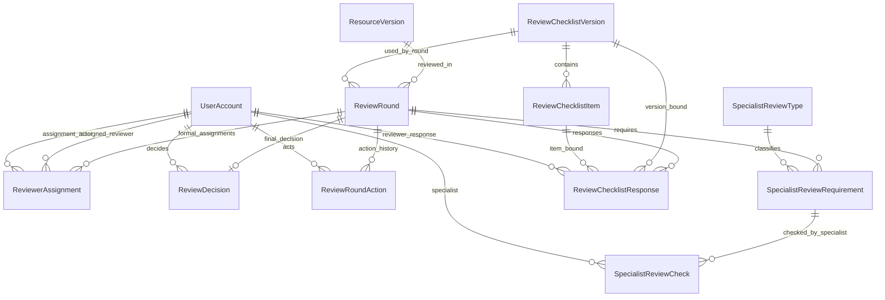
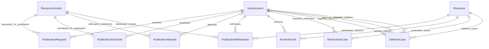
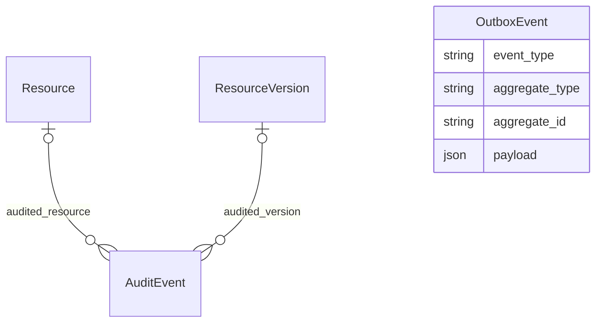

# BWES Phase 2 Entity Relationship Diagram

## 1. Purpose

This document provides a domain-focused ERD for the implemented Phase 2
database model. It is split into smaller Mermaid diagrams so the relationships
remain readable.

The diagrams emphasize relationships, not every scalar field. Database-level
partial unique indexes and check constraints are summarized separately because
Mermaid ER diagrams cannot represent those invariants directly.

## 2. Core Resource And Classification Model



## 3. Type-Specific Metadata



## 4. Organization, Source And Provenance



## 5. Asset Model



## 6. Consent And Lived Experience



## 7. Formal Review And Specialist Review



## 8. Publication And Resource Lifecycle



## 9. Audit And Transactional Outbox



`OutboxEvent` is intentionally modeled as a generic durable asynchronous event
record. It does not currently declare foreign keys to domain aggregate tables.

## 10. Key Database-Level Invariants

Mermaid does not represent partial unique indexes or check constraints, so the
most important implemented invariants are summarized here.

```text
ResourceVersion.version_number > 0
ResourceVersion.lock_version >= 0
UNIQUE(resource_id, version_number)
UNIQUE(resource_id, id)
same-Resource predecessor enforced by composite foreign key
```

```text
At most one DRAFT ResourceVersion per Resource:
UNIQUE(resource_id) WHERE state = 'DRAFT'
```

```text
At most one active SourceApproval per OriginalSource:
UNIQUE(original_source_id) WHERE revoked_at IS NULL
```

```text
At most one primary source per ResourceVersion:
UNIQUE(resource_version_id) WHERE is_primary = true
```

```text
At most one primary document per ResourceVersion:
UNIQUE(resource_version_id) WHERE purpose = 'PRIMARY_DOCUMENT'
```

```text
At most one active ReviewerAssignment per ReviewRound:
UNIQUE(review_round_id) WHERE released_at IS NULL
```

The active-reviewer index may currently appear as
`reviewer_assignments_review_round_id_key`, but it remains a partial unique
index, not unconditional uniqueness.

```text
At most one final ReviewDecision per ReviewRound:
UNIQUE(review_round_id)
```

```text
AuditEvent.resource_version_id requires AuditEvent.resource_id.
OutboxEvent.attempt_count >= 0.
```

## 11. Phase Boundary

The ERD represents the Phase 2 persistence baseline only. It does not imply that
Phase 3 application services, auth integration, workflow transitions,
publication execution, archive/restoration execution, deletion execution,
Directus workflows, object-storage upload processing, outbox processing,
notifications, search, vector ingestion, RAG, or AI evidence evaluation have
been implemented.
